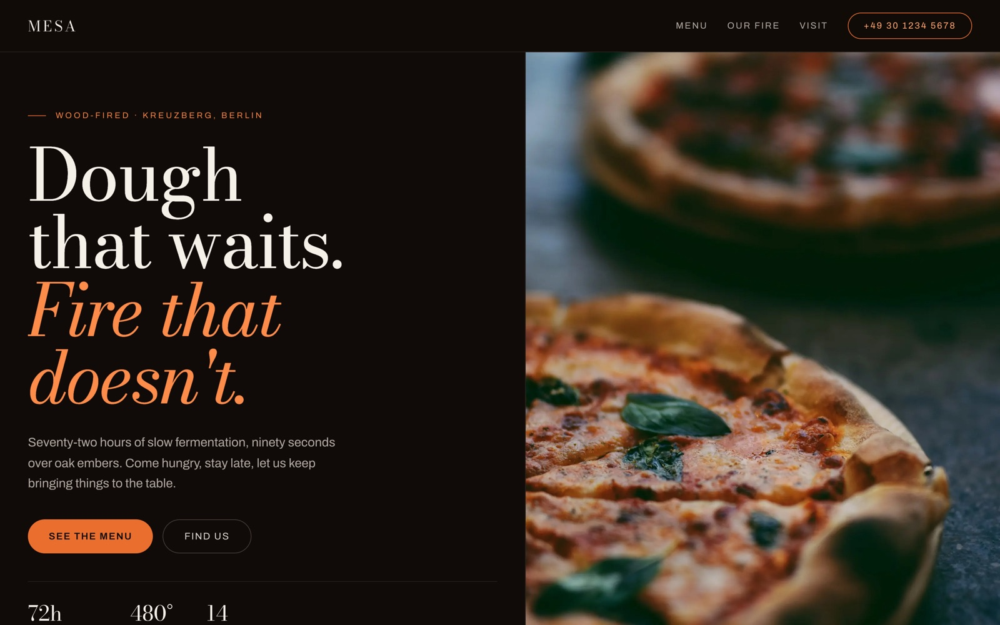
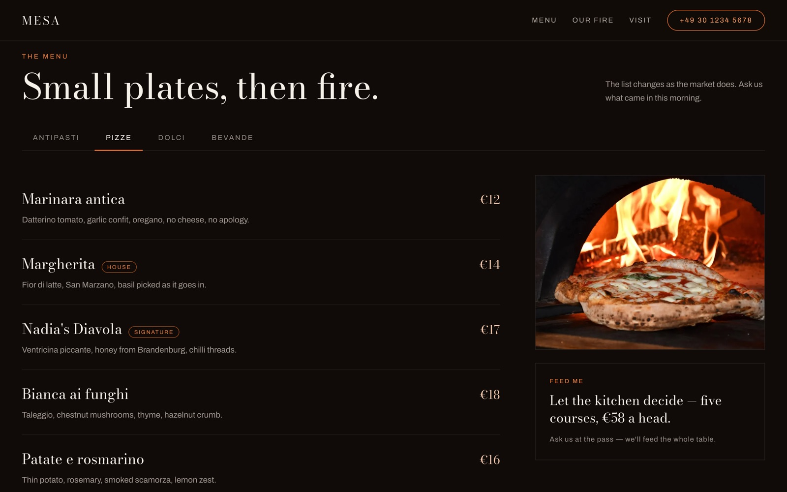

<div align="center">

# Mesa

**A wood-fired restaurant website template — part of the [Templify](https://github.com/manusmd) collection.**

Editorial, warm, and fast. Built with Next.js 16, GSAP, and Lenis.



</div>

---

## Highlights

- 🔥 **Editorial design** — Bodoni Moda + Archivo, warm candlelit palette, oklch colours
- 🍕 **Interactive tabbed menu** — Antipasti / Pizze / Dolci / Bevande with a live-swapping photo
- ✨ **Motion, done right** — Lenis smooth scroll synced to GSAP: masked hero reveal, image parallax, scroll-triggered sections, a progress bar
- ♿ **Accessible & resilient** — fully **no-JS and reduced-motion safe** (content is never hidden behind an animation)
- 🧩 **Content-driven** — the whole site renders from one typed file, `lib/content.ts`
- 🖼️ **`next/image`** throughout (example photography from Unsplash)
- 📄 **Legal pages** — Legal Notice + Privacy Policy placeholders included
- ⚡ **Static** — deploys to Vercel with zero configuration

## A closer look

|  |  |
| --- | --- |
|  | The tabbed menu, the story section, and a visit block round out the page. |

## Getting started

```bash
npm install
npm run dev
```

Open [http://localhost:3000](http://localhost:3000).

## Editing content

Everything the site shows lives in one typed object: **`lib/content.ts`** —
brand, hero, menu categories and dishes, story, visit details, hours, and footer.
Change it and the site updates. Swap the Unsplash image URLs for your own photos.

> The `/legal` and `/privacy` pages hold placeholder text (every `[ … ]` marks a
> value to fill in) — complete and legally review them before launch.

## Deploy

Push to GitHub and import on [Vercel](https://vercel.com/new) — it's a static
Next.js site, nothing to configure.

## Structure

```
lib/content.ts            Site content (typed, single source of truth)
app/page.tsx              The restaurant site (server component)
app/components/           Sections, MenuTabs, Img, Motion (Lenis + GSAP), Legal
app/legal, app/privacy    Legal placeholder pages
```

## Tech

Next.js 16 · React 19 · TypeScript · GSAP + ScrollTrigger · Lenis · next/font

---

<div align="center">
<sub>A Templify template. Example photography via <a href="https://unsplash.com">Unsplash</a>.</sub>
</div>
